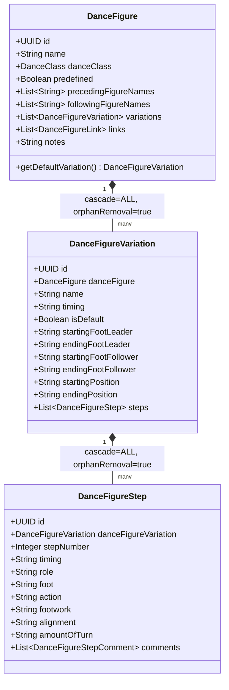

# Multiple Timing Variations Implementation Document

This document outlines the architectural changes, database migrations, model refactoring, and UI improvements implemented to support multiple timing variations per dance figure in DanceBook.

---

## 1. Background & Objectives

Previously, the `DanceFigure` model was limited to a single timing signature and step list (e.g., standard timing only). However, many dance figures have alternative timings (e.g., "1 2 3 & 4" instead of "1 2 3 4" in Waltz, or multiple timing choices in Samba/Cha Cha).

The goals of this refactoring were:
1. Support an arbitrary number of timing variations (e.g., "Standard", "Alternative 1") for any given figure.
2. Maintain a "Default" variation that is shown when the figure is accessed initially.
3. Associate positions, feet metadata (starting/ending foot), and steps breakdown with the timing variation rather than the figure itself.
4. Ensure the Web UI, Syllabus Importer, and LLM-guided edit systems align with this new structure.
5. Strict compliance with Content Security Policy (CSP) directives (no inline JavaScript handlers).

---

## 2. Database Changes

### Migration 1: Schema Refactoring
File: `src/main/resources/db/migration/V24__refactor_figure_variations.sql`

* **New Table (`dance_figure_variation`):**
  Houses the timing variation metadata (`id`, `dance_figure_id`, `name`, `timing`, `is_default`, feet attributes, starting/ending positions).
* **ForeignKey Update on Steps:**
  Changed `dance_figure_step.dance_figure_id` to refer to `dance_figure_variation_id` instead.
* **Data Migration:**
  Wrote a SQL data migration block that extracts existing timing/feet/position metadata from `dance_figure` and creates a default standard variation for every existing figure in the database before dropping the old columns from `dance_figure`.
* **Constraint updates:**
  Dropped obsolete columns from `dance_figure` (`alternative_timing`, `starting_foot_leader`, etc.). Added foreign key and unique constraints.

### Migration 2: Syllabus Seed Data
File: `src/main/resources/db/migration/V25__seed_figures_details.sql`

* Generated dynamically by refactoring the `SqlGenerator.kt` script.
* Maps 224 dance figures to their default standard variations, alongside 1,761 steps and 2,153 step comments seeded from crawled dance central dataset chunks.

---

## 3. Core Architecture & JPA Model Changes



### Relationship Cascades
The `DanceFigure` parent owns its `variations` lifecycle:
```kotlin
@jakarta.persistence.OneToMany(mappedBy = "danceFigure", cascade = [jakarta.persistence.CascadeType.ALL], orphanRemoval = true)
var variations: MutableList<DanceFigureVariation> = mutableListOf()
```
Removing a variation from the list and saving the figure automatically deletes the orphaned record from the database.

---

## 4. Key Code Modifications

### Importers & Scripts
* [SyllabusImporterService.kt](file:///Users/rafal/Developer/Projects/DanceBook/src/main/kotlin/com/jankowski/rafal/dancebook/service/SyllabusImporterService.kt):
  Modified dataset and JSON importers to first look for or initialize a default variation on the figure. Mapped all parsed timing, footwork, and positions to the variation before saving.
* [SqlGenerator.kt](file:///Users/rafal/Developer/Projects/DanceBook/src/main/kotlin/com/jankowski/rafal/dancebook/scripts/SqlGenerator.kt):
  Updated SQL generation logic to insert into the `dance_figure_variation` table first, linking it to the parent figure, then referencing its variation ID inside step insertion blocks.

### LLM-Guided Edit Integration
* [GuidedFigureParseService.kt](file:///Users/rafal/Developer/Projects/DanceBook/src/main/kotlin/com/jankowski/rafal/dancebook/service/GuidedFigureParseService.kt) / [GuidedFigureParseController.kt](file:///Users/rafal/Developer/Projects/DanceBook/src/main/kotlin/com/jankowski/rafal/dancebook/controller/api/GuidedFigureParseController.kt):
  Introduced dual-parsing capability. The AI now evaluates whether the input targets the root figure or a specific timing variation. Guided Edit forms for variations parse external text outputs directly into the variation's metadata, steps, and comments list.

### UI & Content Security Policy (CSP) Compliance
To comply with the browser's Content Security Policy (`script-src 'self' ...`), we removed all inline JavaScript handlers (e.g., `onclick="..."`, `th:onclick="..."`) from Thymeleaf HTML templates.

* **HTML Changes:**
  Replaced event handlers with HTML5 `data-*` variables:
  ```html
  <button class="js-var-tab" th:data-id="${v.id}">...</button>
  ```
* **JavaScript Event Delegation:**
  Registered listeners globally inside [dance-figure-view.js](file:///Users/rafal/Developer/Projects/DanceBook/src/main/resources/static/js/dance-figure-view.js):
  ```javascript
  document.addEventListener('click', (e) => {
      const tabBtn = e.target.closest('.js-var-tab');
      if (tabBtn) {
          switchVariation(tabBtn.getAttribute('data-id'));
      }
  });
  ```

---

## 5. Summary of Files Changed or Added

### Added Files
1. [DanceFigureVariation.kt](file:///Users/rafal/Developer/Projects/DanceBook/src/main/kotlin/com/jankowski/rafal/dancebook/model/DanceFigureVariation.kt) — JPA Entity for variations.
2. [DanceFigureVariationRequest.kt](file:///Users/rafal/Developer/Projects/DanceBook/src/main/kotlin/com/jankowski/rafal/dancebook/dto/DanceFigureVariationRequest.kt) — DTO for variation creation/edit requests.
3. [DanceFigureVariationRepository.kt](file:///Users/rafal/Developer/Projects/DanceBook/src/main/kotlin/com/jankowski/rafal/dancebook/repository/DanceFigureVariationRepository.kt) — Spring Data JPA Repository.
4. [V24__refactor_figure_variations.sql](file:///Users/rafal/Developer/Projects/DanceBook/src/main/resources/db/migration/V24__refactor_figure_variations.sql) — Migration script.
5. [V25__seed_figures_details.sql](file:///Users/rafal/Developer/Projects/DanceBook/src/main/resources/db/migration/V25__seed_figures_details.sql) — Syllabus seeder migration script.
6. [guided-variation-edit.js](file:///Users/rafal/Developer/Projects/DanceBook/src/main/resources/static/js/guided-variation-edit.js) — LLM interface script for variation forms.
7. [variation-form.html](file:///Users/rafal/Developer/Projects/DanceBook/src/main/resources/templates/dance-figures/variation-form.html) — Form view for creating/editing variations.

### Modified Files
1. [DanceFigure.kt](file:///Users/rafal/Developer/Projects/DanceBook/src/main/kotlin/com/jankowski/rafal/dancebook/model/DanceFigure.kt) — Removed deprecated timing/positions columns, added default getters.
2. [DanceFigureStep.kt](file:///Users/rafal/Developer/Projects/DanceBook/src/main/kotlin/com/jankowski/rafal/dancebook/model/DanceFigureStep.kt) — Swapped reference from figure to variation.
3. [DanceFigureSpecification.kt](file:///Users/rafal/Developer/Projects/DanceBook/src/main/kotlin/com/jankowski/rafal/dancebook/repository/DanceFigureSpecification.kt) — Updated join paths for timing search filters.
4. [DanceFigureStepRepository.kt](file:///Users/rafal/Developer/Projects/DanceBook/src/main/kotlin/com/jankowski/rafal/dancebook/repository/DanceFigureStepRepository.kt) — Shifted deletion hooks to target variations.
5. [SqlGenerator.kt](file:///Users/rafal/Developer/Projects/DanceBook/src/main/kotlin/com/jankowski/rafal/dancebook/scripts/SqlGenerator.kt) — Refactored seeder target paths and structure.
6. [DanceFigureService.kt](file:///Users/rafal/Developer/Projects/DanceBook/src/main/kotlin/com/jankowski/rafal/dancebook/service/DanceFigureService.kt) / [DanceFigureServiceImpl.kt](file:///Users/rafal/Developer/Projects/DanceBook/src/main/kotlin/com/jankowski/rafal/dancebook/service/DanceFigureServiceImpl.kt) — CRUD variations, lifecycle rules.
7. [GuidedFigureParseService.kt](file:///Users/rafal/Developer/Projects/DanceBook/src/main/kotlin/com/jankowski/rafal/dancebook/service/GuidedFigureParseService.kt) / [GuidedFigureParseController.kt](file:///Users/rafal/Developer/Projects/DanceBook/src/main/kotlin/com/jankowski/rafal/dancebook/controller/api/GuidedFigureParseController.kt) — Guided parse routing.
8. [SyllabusImporterService.kt](file:///Users/rafal/Developer/Projects/DanceBook/src/main/kotlin/com/jankowski/rafal/dancebook/service/SyllabusImporterService.kt) — Crawler mapping alignment.
9. [dance-figure-view.js](file:///Users/rafal/Developer/Projects/DanceBook/src/main/resources/static/js/dance-figure-view.js) — Tab toggles and CSP listener setups.
10. HTML templates: `form.html`, `list.html`, `view.html` (figures); `edit.html`, `view.html` (choreographies); `view.html` (materials).
11. Unit tests: `DanceFigureWebControllerTest.kt`, `DanceFigureServiceTest.kt`, `SyllabusImporterServiceTest.kt`.
